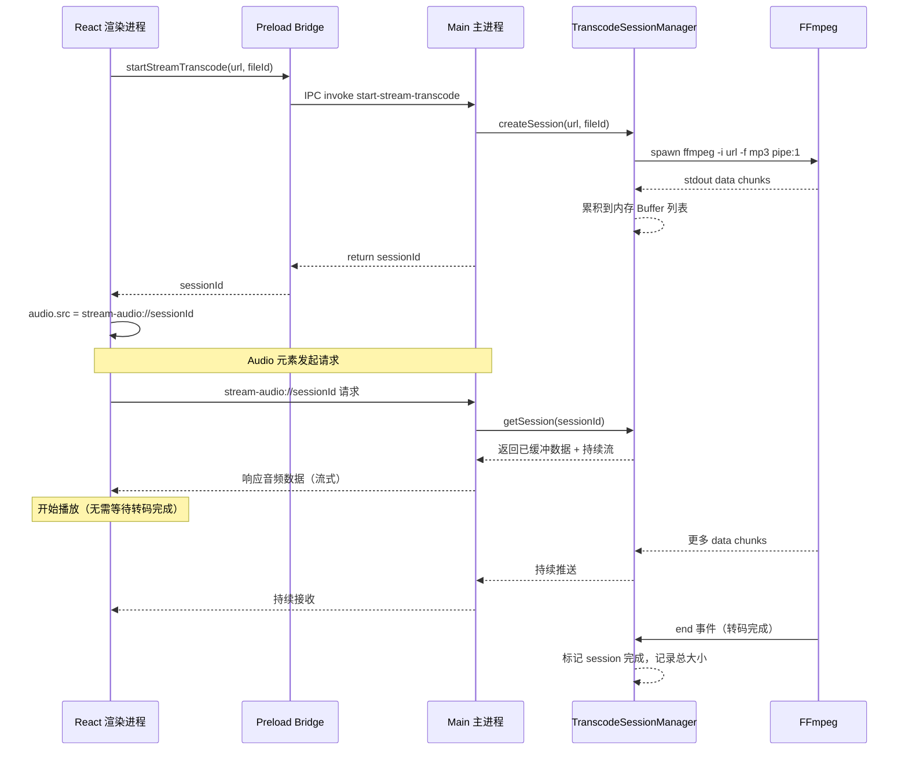
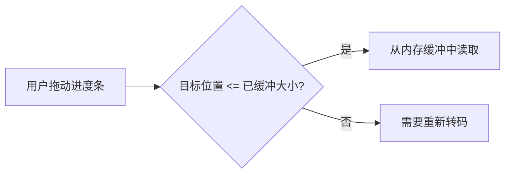
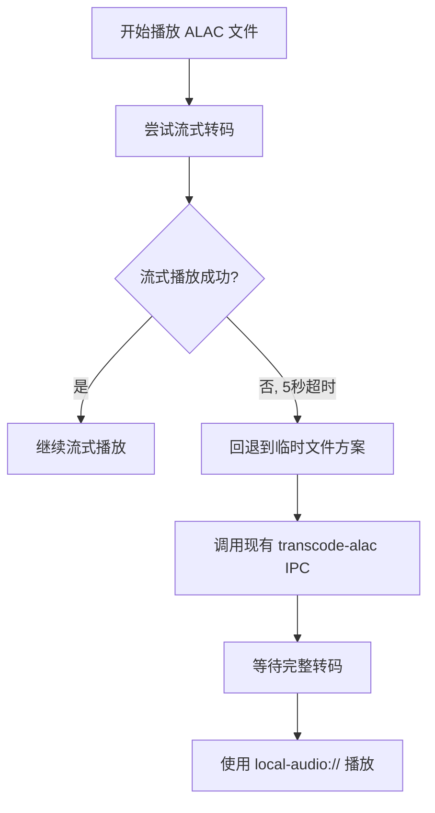

# 流式转码播放 ALAC 音频 - 技术设计方案

## 1. 技术方案概述

### 核心思路

用 **FFmpeg 管道输出 + Electron 自定义协议流式响应** 替代当前"先转码到临时 WAV 文件再播放"的方案。

关键改动：
1. FFmpeg 不再 `.save()` 到临时文件，而是通过 `.pipe()` 输出到 Node.js `PassThrough` 流
2. 输出格式从 WAV 改为 **FLAC**（无损、流式友好、文件比 WAV 小约 40-60%、HTML5 Audio 原生支持）
3. 注册 Electron 自定义协议 `stream-audio://`，将转码流以 HTTP-like 响应暴露给渲染进程
4. 前端 `<audio>` 元素的 `src` 直接设为 `stream-audio://<sessionId>`，无需等待转码完成即可开始播放
5. 通过 **Range 请求 + 双缓冲策略** 支持 seek 操作

> **无损保证**: ALAC 是无损编码，转码输出也必须是无损格式。FLAC 是最佳选择——同为无损编码、流式友好（基于帧的格式）、Chromium/Electron 原生支持、压缩率优于 WAV。

### 与现有方案对比

| 维度 | 当前方案 | 流式方案 |
|------|---------|---------|
| 播放延迟 | 等待整个文件转码完毕 | FFmpeg 输出几秒数据后即可播放 |
| 磁盘占用 | 生成完整 WAV 临时文件（PCM, 约原始大小 2-3x） | 内存缓冲，仅在 seek 时可能写临时文件 |
| 输出格式 | WAV (pcm_s16le) | FLAC（无损，比 WAV 小 40-60%） |
| 音质 | 无损 | **无损**（FLAC 是无损编码，与 ALAC 音质完全一致） |
| Seek 支持 | 完整文件，天然支持 | 需要特殊处理（见第5节） |
| 临时文件管理 | 需要手动清理 | 无临时文件（或极少量） |

---

## 2. 数据流图


### 详细数据流



---

## 3. 关键组件设计

### 3.1 TranscodeSession 类

**文件**: `electron/streaming/transcode-session.ts`

**职责**: 管理单个转码任务的生命周期、缓冲和流式输出

```typescript
interface TranscodeSession {
  sessionId: string;       // 唯一会话ID
  fileId: string;          // 百度网盘文件ID
  sourceUrl: string;       // 源文件URL
  
  // 缓冲管理
  chunks: Buffer[];        // 已转码的数据块列表
  totalBytes: number;      // 已缓冲的总字节数
  isComplete: boolean;     // 转码是否完成
  
  // FFmpeg 进程
  ffmpegProcess: FfmpegCommand | null;
  
  // 流控制
  getBufferedData(offset: number): ReadableStream;  // 从指定偏移开始读取
  
  // 生命周期
  start(): void;           // 启动转码
  abort(): void;           // 终止转码
  destroy(): void;         // 清理所有资源
}
```

核心逻辑：
- 启动时创建 FFmpeg 进程，将 stdout pipe 到内部缓冲
- 每收到一个 chunk，追加到 `chunks` 数组并更新 `totalBytes`
- 当协议处理器请求数据时，从 `chunks` 中拼接返回
- 转码完成后标记 `isComplete`，可选将整个缓冲合并为一个 Buffer 供后续快速访问

### 3.2 TranscodeSessionManager

**文件**: `electron/streaming/session-manager.ts`

**职责**: 管理所有活跃的转码会话，提供缓存和生命周期管理

```typescript
interface SessionManager {
  sessions: Map<string, TranscodeSession>;
  
  createSession(url: string, fileId: string): string;  // 返回 sessionId
  getSession(sessionId: string): TranscodeSession | null;
  destroySession(sessionId: string): void;
  destroyAll(): void;
  
  // 缓存策略：同一 fileId 复用已完成的 session
  findCachedSession(fileId: string): TranscodeSession | null;
}
```

缓存策略：
- 同一 `fileId` 如果已有完成的 session，直接复用（解决"重复转码"问题）
- 内存阈值管理：当总缓冲超过 500MB 时，清理最早的已完成 session
- 应用退出时 `destroyAll()` 清理所有资源

### 3.3 StreamAudioProtocolHandler

**文件**: `electron/streaming/protocol-handler.ts`

**职责**: 注册并处理 `stream-audio://` 自定义协议

```typescript
// 在 app.whenReady() 中注册
protocol.registerStreamProtocol('stream-audio', handler);

function handler(request, callback) {
  // 1. 解析 sessionId: stream-audio://sessionId
  // 2. 从 SessionManager 获取 session
  // 3. 解析 Range 头（如果有）
  // 4. 返回流式响应，包含正确的 Content-Type 和 Content-Length（如已知）
}
```

### 3.4 前端接口更新

**文件**: `electron/preload.ts` - 新增 IPC 接口

```typescript
// 新增
startStreamTranscode: (url: string, fileId: string) => Promise<{sessionId: string}>;
abortStreamTranscode: (sessionId: string) => void;
getTranscodeStatus: (sessionId: string) => Promise<TranscodeStatus>;
```

**文件**: `src/components/player/BackgroundAudio.tsx` - 修改播放逻辑

```typescript
// 替代当前的 transcodeAlac + onTranscodeComplete 流程
// 改为：
const { sessionId } = await window.electronAPI.startStreamTranscode(link, fileId);
audioRef.current.src = `stream-audio://${sessionId}`;
audioRef.current.play();
```

---

## 4. Electron 协议设计

### 4.1 协议注册

使用 Electron 的 `protocol.handle()`（Electron 28+ 推荐）或 `protocol.registerStreamProtocol()` 注册自定义协议。

> **注意**: 项目使用 Electron 28，支持新的 `protocol.handle()` API，这是推荐方式。

```typescript
// electron/streaming/protocol-handler.ts

import { protocol } from 'electron';
import { sessionManager } from './session-manager';
import { PassThrough } from 'stream';

export function registerStreamAudioProtocol() {
  protocol.handle('stream-audio', async (request) => {
    const url = new URL(request.url);
    const sessionId = url.hostname;
    
    const session = sessionManager.getSession(sessionId);
    if (!session) {
      return new Response('Session not found', { status: 404 });
    }
    
    // 解析 Range 请求
    const rangeHeader = request.headers.get('Range');
    
    if (session.isComplete && !rangeHeader) {
      // 转码已完成，返回完整数据
      return new Response(session.getFullBuffer(), {
        headers: {
          'Content-Type': 'audio/flac',
          'Content-Length': String(session.totalBytes),
          'Accept-Ranges': 'bytes',
        }
      });
    }
    
    if (rangeHeader && session.isComplete) {
      // 处理 Range 请求（seek 操作）
      const { start, end } = parseRange(rangeHeader, session.totalBytes);
      const slice = session.getSlice(start, end);
      
      return new Response(slice, {
        status: 206,
        headers: {
          'Content-Type': 'audio/flac',
          'Content-Range': `bytes ${start}-${end}/${session.totalBytes}`,
          'Content-Length': String(end - start + 1),
          'Accept-Ranges': 'bytes',
        }
      });
    }
    
    // 转码进行中，返回流式响应
    const readable = session.createReadableStream();
    return new Response(readable, {
      headers: {
        'Content-Type': 'audio/flac',
        'Transfer-Encoding': 'chunked',
        'Accept-Ranges': 'none',  // 转码中不支持 Range
      }
    });
  });
}
```

### 4.2 协议 URL 格式

```
stream-audio://<sessionId>
```

示例：
```
stream-audio://abc123-def456
```

### 4.3 权限配置

需要在 `protocol.handle` 注册前声明协议特权（如果需要）：

```typescript
// 在 app.whenReady 之前
protocol.registerSchemesAsPrivileged([
  {
    scheme: 'stream-audio',
    privileges: {
      stream: true,        // 支持流式响应
      supportFetchAPI: true,
      bypassCSP: true,
    }
  }
]);
```

> **重要**: `registerSchemesAsPrivileged` 必须在 `app.whenReady()` **之前**调用。

---

## 5. Seek 支持方案

Seek 是流式转码方案中最复杂的部分。分为两种场景：

### 5.1 转码已完成时的 Seek

当 `session.isComplete === true` 时，所有数据已在内存中：
- 直接响应 HTTP Range 请求
- HTML5 Audio 原生支持通过 Range 实现 seek
- 实现简单，性能好

### 5.2 转码进行中的 Seek

分为两种子场景：

#### a) Seek 到已缓冲区域（backward seek 或 seek 到已转码部分）



- 如果目标字节偏移在 `session.totalBytes` 范围内，直接从内存缓冲返回
- 这是最常见的场景（用户回退到之前听过的位置）

#### b) Seek 到未缓冲区域（forward seek 超出已转码部分）

这需要特殊处理：

**方案 A - 时间偏移重新转码（推荐）**：
1. 终止当前 FFmpeg 进程
2. 根据用户 seek 的目标时间，启动新的 FFmpeg 进程，使用 `-ss` 参数跳到目标位置
3. 创建新的 session 接管播放

```typescript
// 伪代码
async function handleSeek(sessionId: string, targetTime: number) {
  const session = sessionManager.getSession(sessionId);
  
  if (targetTime 对应的字节偏移 > session.totalBytes) {
    // 需要重新转码
    session.abort();
    
    const newSession = sessionManager.createSession(
      session.sourceUrl,
      session.fileId,
      { seekTo: targetTime }  // FFmpeg -ss 参数
    );
    
    // 通知前端更新 audio.src
    return newSession.sessionId;
  }
}
```

**方案 B - 等待转码追上**：
- 不推荐，延迟不可控

### 5.3 Seek 的 IPC 协议

```typescript
// preload.ts 新增
seekStreamTranscode: (sessionId: string, targetTime: number) => 
  Promise<{ sessionId: string; needReload: boolean }>;
```

前端 seek 流程：
1. 用户拖动进度条 -> `setCurrentTime(targetTime)`
2. `BackgroundAudio` 检测到时间跳变
3. 调用 `seekStreamTranscode(sessionId, targetTime)`
4. 如果 `needReload === true`，更新 `audio.src = stream-audio://<newSessionId>`
5. 如果 `needReload === false`，浏览器通过 Range 请求自动处理

### 5.4 时间到字节的映射

FLAC 是基于帧的格式，每个帧包含固定数量的采样。虽然 FLAC 帧大小不完全固定（因为压缩率随内容变化），但可以通过以下方式实现时间定位：

1. **构建帧索引表**：在转码过程中，记录每个 FLAC 帧的字节偏移和对应的时间戳
2. **利用 FFmpeg `-ss` 参数**：对于 seek 到未缓冲区域的场景，直接用 FFmpeg 从目标时间点开始转码
3. **近似计算**：在帧索引不可用时，用 `byteOffset = (targetTime / duration) * totalBytes` 近似估算

因此需要在转码时获取源文件的总时长（通过 `ffprobe`），以便在转码未完成时也能计算 seek 偏移。

---

## 6. 降级方案

如果流式方案失败，需要优雅地回退到现有的"临时文件"方案。

### 6.1 降级触发条件

- `protocol.handle` 注册失败
- FFmpeg 管道输出异常
- 流式播放开始后 5 秒内无法播放（超时）
- 内存不足（缓冲超过限制）

### 6.2 降级流程



### 6.3 实现策略

保留现有的 [`audio-stream-transcoder.ts`](electron/audio-stream-transcoder.ts) 中的 `transcode-alac` IPC 处理器不做删除，仅标记为 legacy。在 `BackgroundAudio.tsx` 中实现 try-catch 降级逻辑：

```typescript
try {
  // 优先使用流式方案
  const { sessionId } = await window.electronAPI.startStreamTranscode(link, fileId);
  audioRef.current.src = `stream-audio://${sessionId}`;
  
  // 设置超时检测
  const playPromise = new Promise((resolve, reject) => {
    const timeout = setTimeout(() => reject(new Error('Stream timeout')), 5000);
    audioRef.current.oncanplay = () => { clearTimeout(timeout); resolve(true); };
  });
  
  await playPromise;
} catch (error) {
  console.warn('[播放器] 流式转码失败，降级到临时文件方案', error);
  // 回退到现有方案
  window.electronAPI.transcodeAlac(link, fileId);
}
```

---

## 7. 输出格式选择

### 为什么选 FLAC 而不是 WAV 或 MP3

| 维度 | WAV | MP3 | FLAC |
|------|-----|-----|------|
| 音质 | 无损 | 有损 | **无损** |
| 流式播放支持 | 差（需完整文件头中的大小信息） | 好（帧独立） | **好（基于帧，天然支持流式）** |
| 文件大小 | 原始大小的 2-3x | 原始大小的 0.3-0.5x | **原始大小的 0.5-0.7x** |
| 内存占用 | 极大 | 较小 | **适中** |
| HTML5 Audio 支持 | 完美 | 完美 | **完美（Chromium 56+）** |
| Seek 友好 | 字节精确 | CBR 模式下线性映射 | **帧索引或近似计算** |
| 适合 ALAC 转码 | 无损但浪费空间 | 有损，音质降级 | **无损，最佳平衡** |

**结论**: 使用 FLAC 作为输出格式。ALAC 是无损编码，转码输出也必须保持无损，因此排除 MP3 等有损格式。FLAC 比 WAV 小 40-60%，且基于帧的结构天然支持流式传输，是最佳选择。

FFmpeg 参数：
```
-acodec flac -ar 44100 -ac 2 -f flac pipe:1
```

> **注意**: FLAC 的压缩级别默认为 5（范围 0-12），流式场景下可以使用 `-compression_level 0`（最快压缩）来减少转码延迟，代价是输出文件略大。

---

## 8. 需要修改的文件清单

### 新增文件

| 文件路径 | 说明 |
|---------|------|
| `electron/streaming/transcode-session.ts` | 单个转码会话管理，包含 FFmpeg 管道和内存缓冲逻辑 |
| `electron/streaming/session-manager.ts` | 会话管理器，缓存策略、内存限制、生命周期管理 |
| `electron/streaming/protocol-handler.ts` | `stream-audio://` 协议注册与请求处理 |
| `electron/streaming/index.ts` | 模块导出入口 |

### 修改文件

| 文件路径 | 修改内容 |
|---------|---------|
| [`electron/main.ts`](electron/main.ts) | 1. 在 `app.whenReady()` 之前调用 `registerSchemesAsPrivileged`<br>2. 在 `app.whenReady()` 中调用 `registerStreamAudioProtocol()` 和 `setupStreamTranscodeIPC()`<br>3. 在 `before-quit` 中调用 `sessionManager.destroyAll()` |
| [`electron/preload.ts`](electron/preload.ts) | 新增 `startStreamTranscode`、`abortStreamTranscode`、`seekStreamTranscode`、`getTranscodeStatus` IPC 接口 |
| [`src/types/electron.d.ts`](src/types/electron.d.ts) | 新增上述 IPC 接口的类型定义 |
| [`src/components/player/BackgroundAudio.tsx`](src/components/player/BackgroundAudio.tsx) | 1. 重构 ALAC 播放逻辑，优先使用流式方案<br>2. 实现 seek 时的 session 切换逻辑<br>3. 实现降级回退逻辑<br>4. 清理 session 资源 |
| [`electron/audio-stream-transcoder.ts`](electron/audio-stream-transcoder.ts) | 保留作为降级方案，添加 `@deprecated` 注释 |

### 不需要修改的文件

| 文件路径 | 原因 |
|---------|------|
| [`src/store/playerStore.ts`](src/store/playerStore.ts) | 播放状态管理不受影响，`currentTime`/`duration`/`isPlaying` 等接口不变 |
| [`package.json`](package.json) | 不需要新增依赖，`fluent-ffmpeg` 和 `ffmpeg-static` 已经存在 |
| [`src/services/baidu-api.service.ts`](src/services/baidu-api.service.ts) | 获取下载链接的逻辑不变 |

---

## 9. 实施步骤

1. **创建 `electron/streaming/` 目录及核心模块**
   - 实现 `TranscodeSession` 类
   - 实现 `SessionManager` 
   - 实现 `protocol-handler.ts`

2. **注册自定义协议**
   - 在 `main.ts` 中添加 `registerSchemesAsPrivileged`（必须在 `app.whenReady` 之前）
   - 在 `app.whenReady` 回调中注册协议和 IPC 处理器

3. **更新 Preload 和类型定义**
   - 在 `preload.ts` 中暴露新的 IPC 接口
   - 在 `electron.d.ts` 中添加类型

4. **重构前端播放逻辑**
   - 修改 `BackgroundAudio.tsx` 使用流式方案
   - 实现降级逻辑

5. **测试验证**
   - ALAC 文件流式播放
   - Seek 操作（已缓冲/未缓冲区域）
   - 降级回退
   - 内存使用监控
   - 多次切歌时的资源清理

---

## 10. 风险与注意事项

### 10.1 内存管理
- 一首 5 分钟的歌曲转码为 FLAC 约 25-35MB（取决于音频内容复杂度），内存负担可接受
- 但需要在切歌时及时销毁旧 session
- 设置全局内存上限（如 500MB），超过时强制清理最早的 session

### 10.2 FFmpeg 进程管理
- 确保在切歌/关闭时正确 kill FFmpeg 子进程
- 处理 FFmpeg 意外崩溃的场景

### 10.3 百度网盘 URL 过期
- 百度网盘下载链接有时效性，长时间播放同一 session 时 URL 可能过期
- Session 缓存可以缓解此问题（已转码的数据不依赖 URL）
- 如果 seek 触发重新转码，需要重新获取下载链接

### 10.4 Electron protocol.handle 兼容性
- `protocol.handle()` 是 Electron 25+ 的 API，项目使用 Electron 28 完全兼容
- 如果需要支持更老版本，可降级使用 `protocol.registerStreamProtocol()`（已废弃但仍可用）

### 10.5 FLAC 流式特性
- FLAC 是 VBR（可变码率）格式，帧大小不固定，时间到字节的映射不是严格线性的
- 解决方案：在转码过程中构建简单的帧索引表（记录关键帧的字节偏移和时间戳）
- 对于 seek 到未缓冲区域的场景，优先使用 FFmpeg `-ss` 参数重新转码（最可靠）
- 对于 seek 到已缓冲区域的场景，使用帧索引表定位最近的帧边界